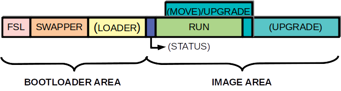
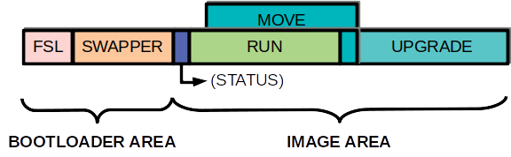
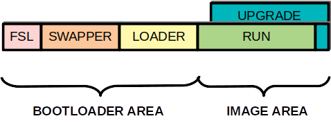

<!--
  Copyright (c) 2018 Laczen

  SPDX-License-Identifier: Apache-2.0
-->
# ZB-eight - A First Stage Loader and upgradeable bootloader

**ZB-eight - A work in progress - expect rough edges**

_If you need commercial support for ZB-8 do not hesitate to contact me._

I will read the documentation later - take me to [getting started](./docs/getting_started.md)

## **UPGRADEABLE, SECURE, SMALL, VERSATILE, MULTI-IMAGE BOOTLOADER FOR 32-bit MCU**

## Overview

ZB-eight (ZB-8) is a secure bootloader for 32-bit MCUs. It is a combination of
different element that allow upgrading and executing images. ZB-eight is
developed on top of the zephyr RTOS. Some of the idea's used in the
implementation are coming from MCUboot, a similar bootloader for 32-bit MCUs.
It is very versatile and can be configured for several use cases.



As can be seen from the drawing above the bootloader consists of a FSL, a
swapper, a loader and a firmware image (run). Each of these elements has
specific tasks:

a. The first stage loader (FSL) is responsible for starting the firmware image
or updating the swapper or loader image.

b. The swapper is responsible for decrypting and moving images that are placed
in the upgrade area to the run area.

c. The loader is used to update the image in the upgrade slot. The loader
includes a communication method. The loader is an optional element, this
functionality can also be included in the firmware (run) image.

d. The firmware (run) image that contains the user code to be executed on the
device.

Several elements in the drawing above are placed within brackets (), these
elements are optional.

## Security

Firmware images are protected by a EC-256 signature and are encrypted using
AES-128 CTR. This ensures images are coming from a known origin and intellectual
property is protected. Insecure channels can be used to transfer the images to
the device, the image is only decrypted on the device prior to starting the
image.

## Boot process

When a device comes out of reset it starts the first stage loader (FSL). The FSL
verifies the run image against a CRC32, if the verify checks out (and the image is not a swapper or loader image) the FSL starts the run image. This is a the standard boot process.

If the CRC32 checks out but the image is a swapper or a loader image, the FSL first moves these images to the correct location and restarts.

If the CRC32 check fails (indicating a update is required), the FSL starts the swapper. The swapper verifies the image in the upgrade slot and if a correct image is found in the upgrade slot the swapper will decrypt the upgrade image to the run slot. After this the swapper starts the newly upgraded image.

## Upgrade process

The upgrade process starts by placing a upgrade image in the upgrade area. How
this is done depends on the bootloader configuration.

If the run image contains the required communication routines to receive a
upgrade image, the run image places the upgrade image in the upgrade slot and
invalidates the CRC32. The run image then calls the *__swapper__* to do the upgrade.

If on the other hand the run image does not contain any communication routines
to receive the upgrade image, the *__loader__* image should be capable of
performing this task. The run image starts the *__loader__* image. The
*__loader__* image then receives and writes the new image to the upgrade slot, invalidates the CRC32 and calls the *__swapper__* to do the upgrade.

The upgrade image that is placed in the upgrade area can be a upgrade for the
*__run__* image, the *__swapper__* image or the *__loader__* image. All these
images can be upgraded.

## Configuration

The configuration of zb-8 is done using dts overlay files. A dts overlay file is setup describing the different flash partitions that are used. Omitting a definition results in a change of functionality.

### Configuration example 1 - MCUboot style



The drawing above shows a typical mcuboot style image setup. This setup lacks a
loader image and has separate upgrade and run areas. A swap status area is used
to ensure that a swap can be interrupted. The upload communication routines are
integrated in the run image.

This setup can be done using the following overlay (for a nrf52832).

```
/*
 * Copyright (c) 2019 Laczen
 *
 * Overlay file for ZB-8 dual image setup
 *
 * SPDX-License-Identifier: Apache-2.0
 */

/delete-node/ &boot_partition;
/delete-node/ &scratch_partition;
/delete-node/ &slot0_partition;
/delete-node/ &slot1_partition;
/delete-node/ &storage_partition;

/ {
	chosen {
		zephyr,code-partition = &run0_partition;
	};
};

&flash0 {
	/*
	 * For more information, see:
	 * http://docs.zephyrproject.org/latest/guides/dts/index.html#flash-partitions
	 */
	partitions {
		compatible = "fixed-partitions";
		#address-cells = <1>;
		#size-cells = <1>;

		fsl_partition: partition@0 {
			label = "fsl";
			reg = <0x00000000 0x00001000>;
		};
		swpr_partition: partition@1000 {
			label = "swpr";
			reg = <0x00001000 0x00004000>;
		};
		swpstat0_partition: partition@5000 {
			label = "swpstat-0";
			reg = <0x0005000 0x0001000>;
		};
		run0_partition: partition@6000 {
			label = "run-0";
			reg = <0x0006000 0x0003B000>;
		};
		move0_partition: partition@7000 {
			label = "move-0";
			reg = <0x0007000 0x0003B000>;
		};
		upgrade0_partition: partition@42000 {
			label = "upgrade-0";
			reg = <0x00042000 0x0003B000>;
		};
		storage_partition: partition@7D000 {
			label = "storage";
			reg = <0x0007D000 0x00003000>;
		};
	};
};
```

### Configuration example 2 - Small flash/ram style

On some devices the configuration example 1 is less suited, e.g. a nrf52810 which has limited flash (192kB) and/or limited ram (24kB). In that case the following setup can be done:



The setup illustrated by the drawing above has a loader image and a overlapping
run and upgrade image. In this case the loader is responsible for the writing of
the upgrade image to the upgrade slot. As can be seen this setup is also lacking
a status region, this means it cannot recover from a powerdown during the swap
phase. In that case the image has to be rewritten by the loader.

This setup can be done using the following overlay (for a nrf52810).

```
/*
 * Copyright (c) 2019 Laczen
 *
 * Overlay file for ZB-8 single image setup
 *
 * SPDX-License-Identifier: Apache-2.0
 */

/delete-node/ &boot_partition;
/delete-node/ &scratch_partition;
/delete-node/ &slot0_partition;
/delete-node/ &slot1_partition;
/delete-node/ &storage_partition;

/ {
	chosen {
		zephyr,code-partition = &run0_partition;
	};
};

&flash0 {
	/*
	 * For more information, see:
	 * http://docs.zephyrproject.org/latest/guides/dts/index.html#flash-partitions
	 */
	partitions {
		compatible = "fixed-partitions";
		#address-cells = <1>;
		#size-cells = <1>;

		fsl_partition: partition@0 {
			label = "fsl";
			reg = <0x00000000 0x00001000>;
		};
		swpr_partition: partition@1000 {
			label = "swpr";
			reg = <0x00001000 0x00004000>;
		};
		ldr_partition: partition@5000 {
			label = "ldr";
			reg = <0x0005000 0x0011000>;
		};
		run0_partition: partition@16000 {
			label = "run-0";
			reg = <0x0016000 0x00017000>;
		};
		upgrade0_partition: partition@17000 {
			label = "upgrade-0";
			reg = <0x00017000 0x00017000>;
		};
		storage_partition: partition@2E000 {
			label = "storage";
			reg = <0x0002E000 0x00002000>;
		};
	};
};
```

The provided example allows for a loader to be 68kB (sufficient for a ble_dfu),
and a image size of 92kB. Although the supported image size is small the setup
includes all security and versatility (upgradeable swapper, loader), and the
run image does not need to include any communication routines. An mcuboot style
of setup would reduce the possible images to 80kB and this should include the
communication routines for upgrade.

## Multi image support

ZB-8 allows the definition of multiple image areas. This allows several images
to be defined and upgraded. A typical use case for this is MCU's that have a
secure and a non-secure part and the secure part is reponsible for starting the
non-secure part. ZB-8 will only start the image in the first run area.

Multi image support can also be used as a means to provide a upgradeable storage area (fully protected by signature and encryption.

## Downgrade protection

ZB-8 protects against downgrades by including a dependency in each image that
designates what images it can replace. An image that has a lower version than
the image in the run slot is not allowed to replace this image.

## Image confirmation

ZB-8 supports unconfirmed (test) images and confirmed images. Unconfirmed images
will execute only one time (after being swapped to the run slot). Unconfirmed images can be confirmed by the image itself (while being executed the first time), or by the loader.

The image tool provided by ZB-8 allows images to be confirmed at creation.

## Where can I find what ?

[./zb8](./zb8) contains the library of routines that make up ZB-8,

[./fsl](./fsl) contains the First Stage Loader,

[./swapper](./swapper) contains a the image swapper,

[./loader/bledfu_loader](./loader/bledfu_loader) contains a ble dfu loader, other loaders will follow,

[./apps](./apps) contains a sample application that provides ble dfu
functionality [./apps/app_bledfu](./apps/app_bledfu) and a simple test
application [./apps/test](./apps/test),

[./tests](./tests) contains tests to validate ZB-8 routines,

[./scripts](./scripts) contains tools to create images for ZB-8,

## Documentation
~~Project documentation is located in the [docs](./docs/index.md) folder.~~
needs updating
